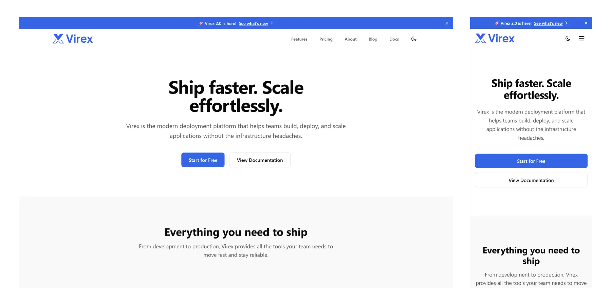
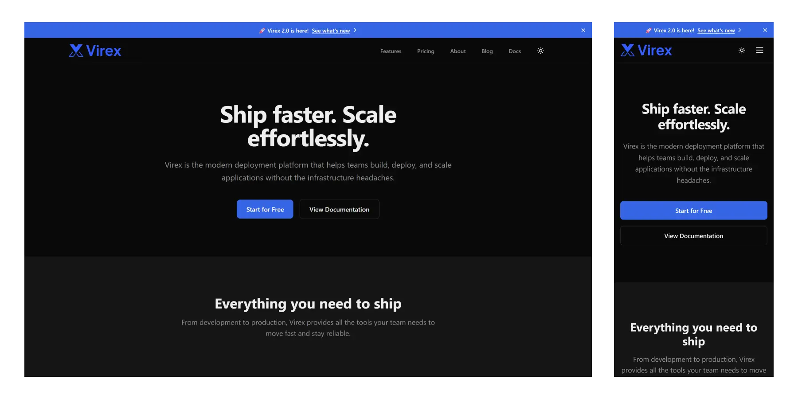

# Virex - SaaS Landing Page Theme for Astro

[](https://astro.build)
[](https://opensource.org/licenses/MIT)

A production-ready SaaS landing page theme for Astro. Built for those who want to launch marketing sites quickly. It focuses on simplicity and performance, making it effortless to customize and extend.

## Demo




**Live Demo**: [https://virex.erland.me](https://virex.erland.me)

## Features

- **Astro 5** with TypeScript and Tailwind CSS v4
- **Content Collections** for blog, docs, changelog, and testimonials
- **Blog** with pagination, tag filtering, and reading time
- **Documentation** with auto-generated sidebar
- **Design Tokens** for easy brand customization (OKLCH colors)
- **Dark Mode** with localStorage persistence and system preference detection
- **SEO Ready** with meta tags, Open Graph, Twitter Cards, JSON-LD, sitemap, and RSS
- **Feature Flags** to enable/disable sections (blog, docs, changelog, testimonials, roadmap)
- **Contact Form** with validation and multiple backend support (Netlify, Formspree, custom)
- **Legal Pages** for privacy policy and terms of service
- **Accessibility** with focus states, reduced motion support, and semantic HTML
- **200,000+ Icons** via astro-icon (Lucide + Simple Icons included)

## Quick Start

```bash
# Clone the repository
git clone https://github.com/erlandv/virex.git
cd virex

# Install dependencies
npm install

# Start development server
npm run dev
```

Open [http://localhost:4321](http://localhost:4321) to see your site.

## Documentation

Full documentation is available in the [`docs/`](./docs/) folder:

1. [Getting Started](./docs/01-getting-started.md) - Installation and project structure
2. [Configuration](./docs/02-configuration.md) - Site settings and feature flags
3. [Customization](./docs/03-customization.md) - Design tokens, logo, and branding
4. [Content Guide](./docs/04-content-guide.md) - Blog, docs, changelog, testimonials
5. [Components](./docs/05-components.md) - Icons, forms, and UI components
6. [Pages](./docs/06-pages.md) - Available pages and routing
7. [Deployment](./docs/07-deployment.md) - Deploy to Vercel, Netlify, Cloudflare

## Project Structure

```
src/
├── components/     # Reusable UI components
├── config/         # Site configuration (edit these!)
├── content/        # Blog, docs, changelog, testimonials (Markdown/MDX)
├── layouts/        # Page layouts
├── lib/            # Utilities and types
├── pages/          # Route pages
└── styles/         # Design tokens and global styles
```

## Configuration

All configuration is centralized in `src/config/`:

| File | Purpose |
|------|---------|
| `site.ts` | Site name, description, URL, social links |
| `features.ts` | Toggle blog, docs, changelog, testimonials, roadmap |
| `navigation.ts` | Navbar links |
| `contact.ts` | Contact information and methods |
| `content.ts` | Announcement bar and newsletter text |

## Scripts

| Command | Description |
|---------|-------------|
| `npm run dev` | Start development server at localhost:4321 |
| `npm run build` | Build for production to `dist/` |
| `npm run preview` | Preview production build locally |

## License

Virex is free for personal and commercial use under the [MIT License](./LICENSE). A link back to this repo is appreciated but not required.
